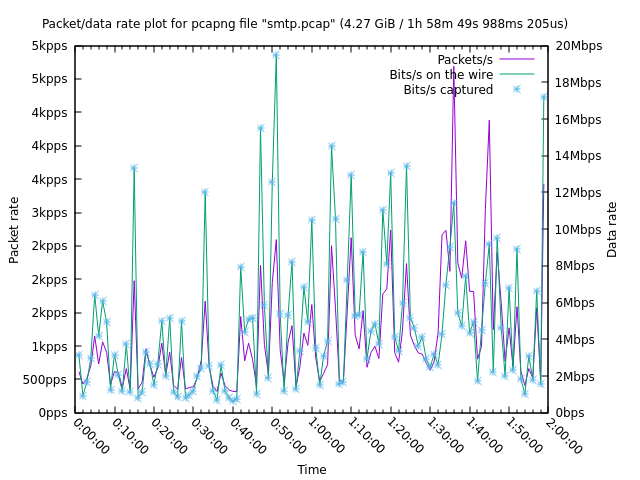
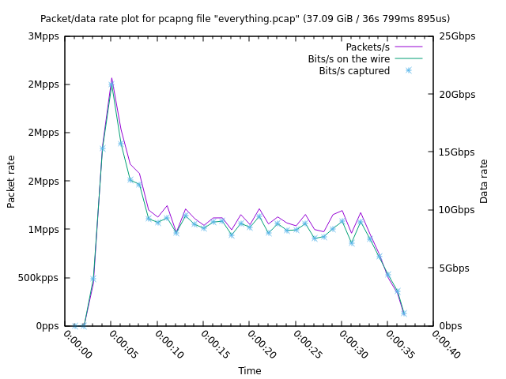

# plotcap

## Introduction

`plotcap` is a small command line utility for plotting the packet and data rates of the network traffic in a PCAP file.

It aggregates three measurements at regular intervals (default of 1s, but adjustable via the `-i` argument) seconds:
- Packet count
- Bytes on the wire
- Bytes captured (different from the wire size if snaplen is less than the packet size)

`plotcap` then writes an executable [gnuplot](http://www.gnuplot.info/) script that embeds the data for the above measurements
and plots them on two Y axis (left for packets per second, right for Bytes per second) with relative time on the X axis.

Because the output file can be relatively small, you can easily copy it off the system where `plotcap` is executed 
(a handy trick in constrained environments, especially with a statically linked binary - see the section below) and
then execute the script on your laptop (or any GUI system with `gnuplot` installed) for visualisation.

Note that the output script runs `gnuplot` in persistent mode (`-p`) and uses `pause mouse close` to allow interaction with the
plot. This is useful for zooming into areas (try right-click and drag).

## Building

To install the latest version of `plotcap`, ensure you have a [Rust toolchain installed](https://rustup.rs/), then run:

```shell
cargo install plotcap
```

Or, to build from source (binary in `target/release/plotcap`):

```shell
cargo build --release
```

To build a statically linked version of `plotcap`, you need the Rust MUSL toolchain, which you can install with:

```shell
rustup target add x86_64-unknown-linux-musl
```
...after which you can build it with:

```shell
cargo build --target=x86_64-unknown-linux-musl --release
```

The resulting static binary is located at `target/x86_64-unknown-linux-musl/release/plotcap`.

## Usage

```shell
plotcap --help
plotcap 0.1.0
Simeon Miteff <simeon.miteff@corelight.com>
Plot packet and data rates over time given a PCAP file

USAGE:
    plotcap [OPTIONS] --read <FILE> --output <FILE>

OPTIONS:
    -h, --help                   Print help information
    -i, --interval <INTERVAL>    [default: "1 second"]
    -o, --output <FILE>          
    -r, --read <FILE>            
    -V, --version                Print version information
```

## Examples

`smtp.pcap` is a ~2h, ~4.3GB file with 8k packets in it. To reduce the number of plot points we increase the aggregation
to 60s with `-i 60s`:

```shell
plotcap -r smtp.pcap -i 60s -o smtp-60s.plg
```

The resulting `smtp-60s.plg` is 142 lines (5.4KB). Running the script produces:



`everything.pcap` is a ~37s, ~38GB file with 37 million packets in it. We run `plotcap` with the default aggregation interval:

```shell
plotcap -r everything.pcap -o everything.plg
```

The output file is 60 lines (2.5KB). Running it produces:


